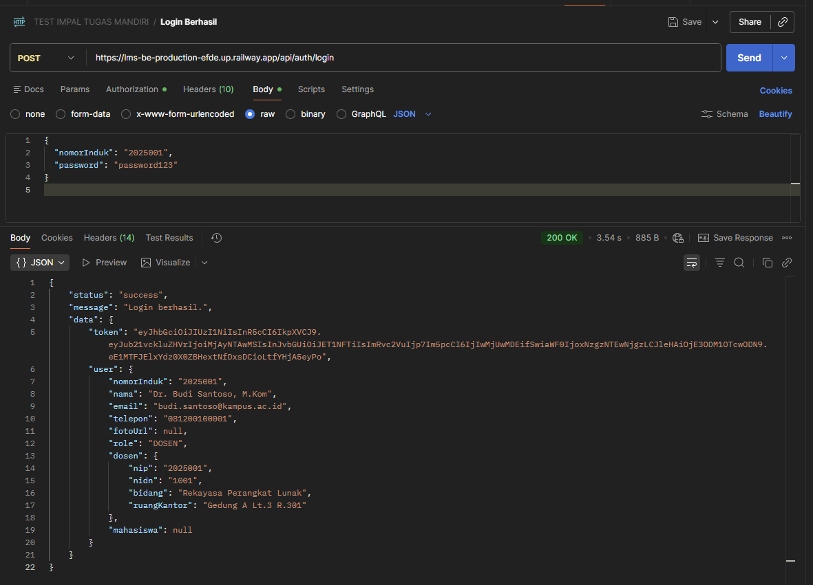
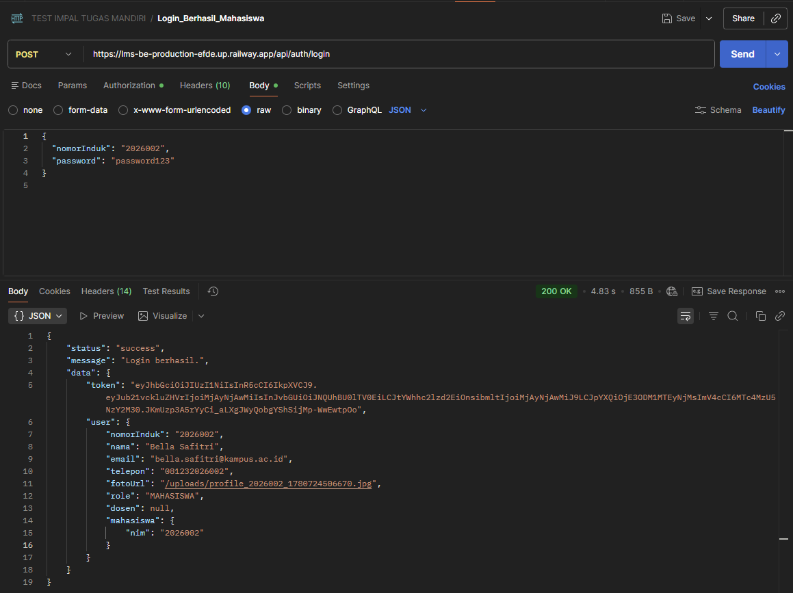
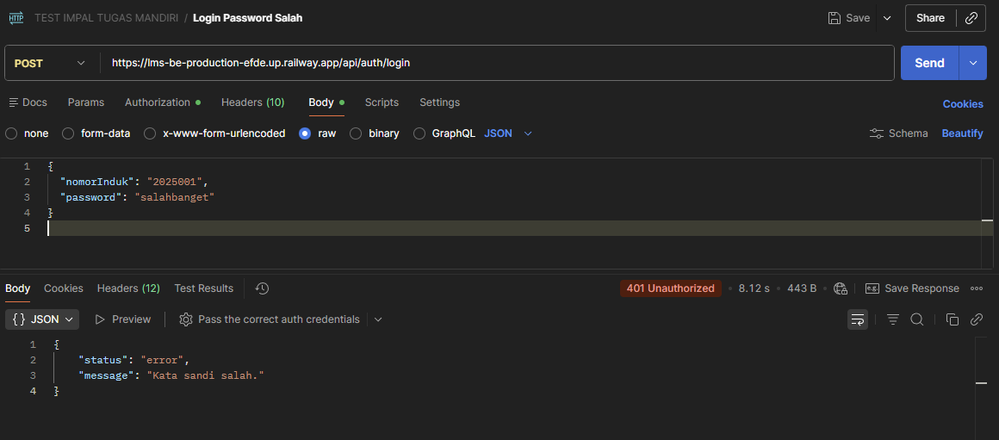
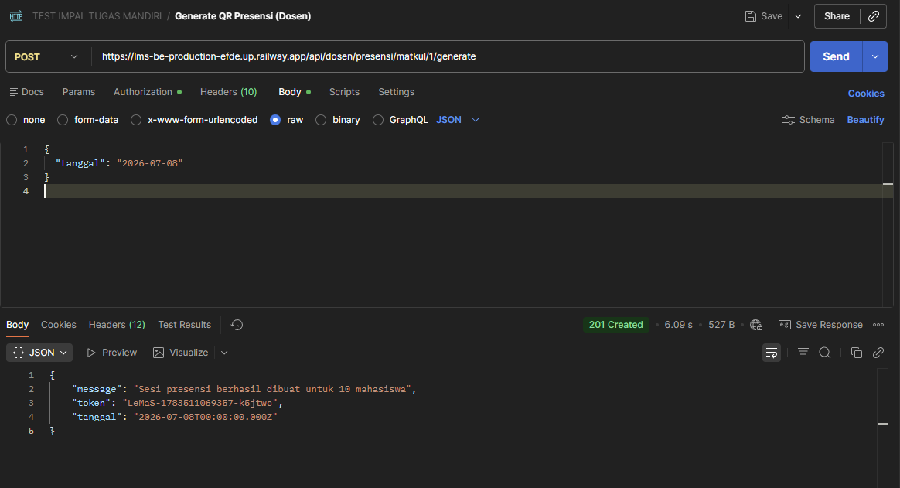
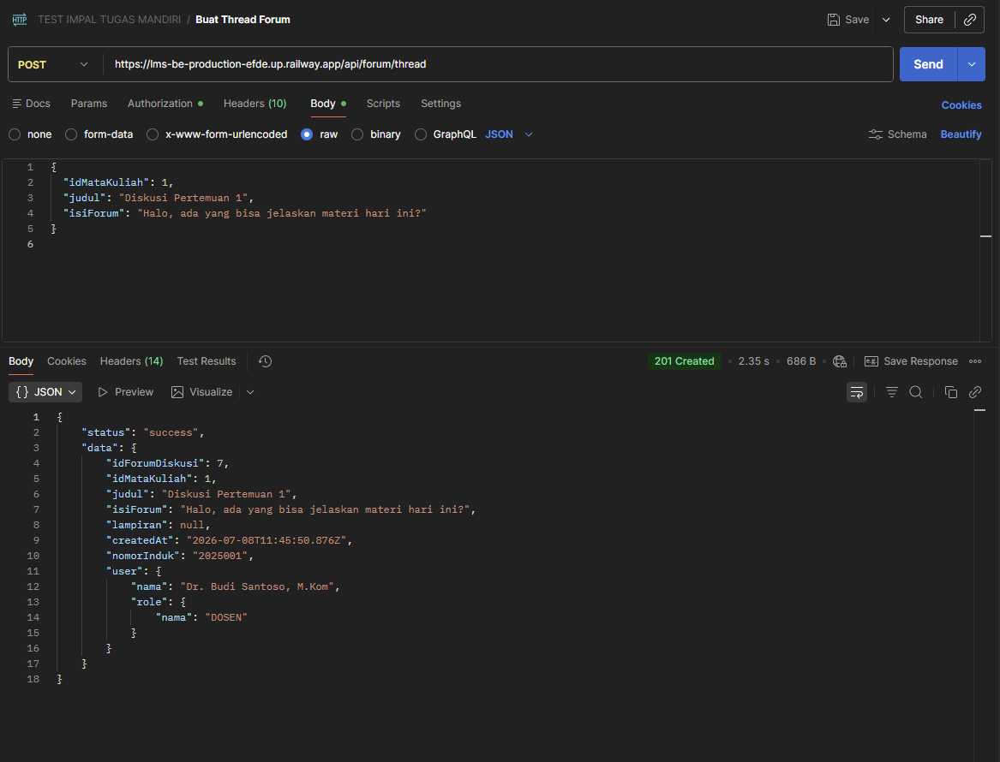
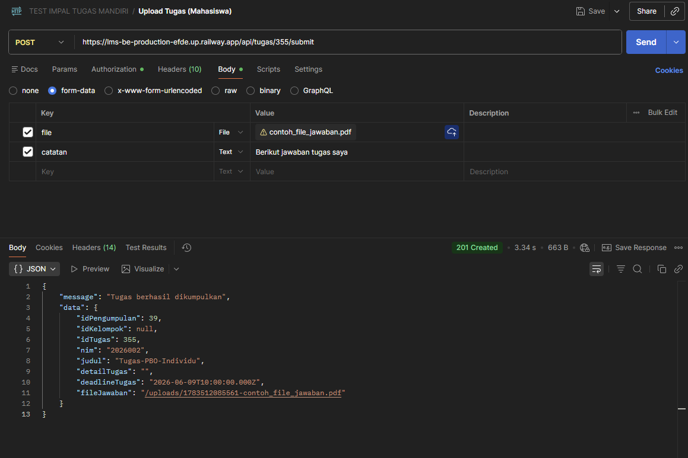
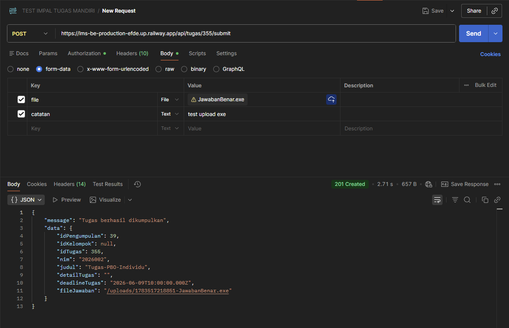
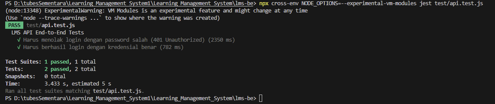

# Testing Report — Implementasi Metrik Pengujian

**Nama:** Muhammad Daffa  
**Mata Kuliah:** Implementasi Perancangan Perangkat Lunak  
**Dosen:** Muhammad Shiddiq Azis, S.T., MBA  
**Proyek:** LeMaS — Learning Management System  
**Repository:** <https://github.com/Erden276/lms-be>  
**Frontend (Vercel):** `https://learning-management-system-nu-six.vercel.app`  
**Backend / Base URL API (Railway):** `https://lms-be-production-efde.up.railway.app`  
**Database:** PostgreSQL via Supabase  
**Tanggal:** 8 Juli 2026  

---

## Langkah 1 – Menentukan Fitur yang Diuji

Fitur yang dipilih dari aplikasi LeMaS:

1. **Login / Autentikasi** — Proses login untuk Dosen dan Mahasiswa menggunakan JWT.
2. **Upload Tugas** — Mahasiswa mengumpulkan file jawaban tugas via form-data.
3. **Presensi QR Code** — Dosen generate token QR, mahasiswa scan untuk mencatat kehadiran.
4. **Forum Diskusi** — Pengguna membuat thread, komentar, dan like di forum mata kuliah.

---

## Langkah 2 – Membuat Test Case

> Total: **20 test case** | Minimal: 15

| No | Fitur | Skenario | Expected Result | Status |
|----|-------|----------|-----------------|--------|
| 1 | Login | Email dan password dosen benar | Berhasil login, mendapat token JWT | Pass |
| 2 | Login | NIM dan password mahasiswa benar | Berhasil login, mendapat token JWT | Pass |
| 3 | Login | Password salah | Muncul pesan error 401 Unauthorized | Pass |
| 4 | Login | Email/NIM kosong | Validasi muncul, tidak bisa login | Pass |
| 5 | Login | Role tidak sesuai (mahasiswa input role DOSEN) | Ditolak, muncul pesan error | Pass |
| 6 | Login | Token expired digunakan untuk request | Response 401, token tidak valid | Pass |
| 7 | Upload Tugas | Upload file PDF yang valid | File berhasil diunggah, status "Terkumpul" | Pass |
| 8 | Upload Tugas | Upload file tanpa memilih file | Muncul pesan error, upload gagal | Pass |
| 9 | Upload Tugas | Upload file berformat .exe (bukan dokumen) | Server menolak, muncul pesan error tipe file | Fail |
| 10 | Upload Tugas | Mahasiswa upload tugas yang sudah melewati deadline | Muncul pesan deadline terlewat, upload ditolak | Fail |
| 11 | Upload Tugas | Mahasiswa upload ulang (replace) tugas yang sudah dikumpulkan | File lama tergantikan, status tetap "Terkumpul" | Pass |
| 12 | Upload Tugas | Hapus pengumpulan sebelum deadline | Pengumpulan terhapus, status kembali "Belum Kumpul" | Pass |
| 13 | Presensi QR | Dosen generate token QR untuk hari ini | Token QR berhasil dibuat, muncul di response | Pass |
| 14 | Presensi QR | Mahasiswa scan QR dengan token yang valid | Kehadiran tercatat sebagai "Hadir" | Pass |
| 15 | Presensi QR | Mahasiswa scan QR dua kali (duplikasi) | Sistem menolak, muncul pesan sudah absen | Pass |
| 16 | Presensi QR | Mahasiswa scan QR dengan token yang salah/palsu | Muncul pesan error token tidak valid | Pass |
| 17 | Presensi QR | Dosen generate QR tanpa mengisi tanggal | Muncul validasi, generate gagal | Fail |
| 18 | Forum Diskusi | Pengguna membuat thread forum baru | Thread berhasil dibuat, muncul di daftar | Pass |
| 19 | Forum Diskusi | Pengguna menambah komentar di thread | Komentar berhasil diposting | Pass |
| 20 | Forum Diskusi | Pengguna menghapus thread milik orang lain | Ditolak dengan respons 403 Forbidden | Pass |

---

## Langkah 3 – Menghitung Metrik

### 1. Total Test Case

```
Total Test Case = 20
```

### 2. Pass Rate

```
Pass Rate = Jumlah PASS / Total Test Case × 100%
          = 17 / 20 × 100%
          = 85%
```

### 3. Fail Rate

```
Fail Rate = Jumlah FAIL / Total Test Case × 100%
          = 3 / 20 × 100%
          = 15%
```

### 4. Defect Count

Jumlah bug yang ditemukan: **3 bug**

| No | Bug | Fitur | Kategori |
|----|-----|-------|----------|
| 1 | Server tidak memvalidasi tipe file saat upload (menerima .exe) | Upload Tugas | Major |
| 2 | Tidak ada pengecekan deadline saat mahasiswa submit tugas | Upload Tugas | Major |
| 3 | Generate QR tanpa parameter tanggal tidak menghasilkan pesan validasi yang jelas | Presensi QR | Minor |

**Pengelompokan:**

- 🔴 **Critical:** 0 bug
- 🟠 **Major:** 2 bug
- 🟡 **Minor:** 1 bug

### 5. Defect Density (Sederhana)

```
Defect Density = Jumlah Bug / Jumlah Fitur
              = 3 / 4
              = 0.75 bug per fitur
```

---

## Langkah 4 – Dokumentasi Bukti

### Screenshot 1 — Login Dosen Berhasil (TC-01)

> Endpoint: `POST https://lms-be-production-efde.up.railway.app/api/auth/login`  
> Input: `{ "nomorInduk": "2025001", "password": "password123" }`  
> Hasil: Response `200 OK` dengan token JWT



---

### Screenshot 2 — Login Mahasiswa Berhasil (TC-02)

> Endpoint: `POST https://lms-be-production-efde.up.railway.app/api/auth/login`  
> Input: `{ "nomorInduk": "2026002", "password": "password123" }`  
> Hasil: Response `200 OK` dengan token JWT



---

### Screenshot 3 — Login Password Salah (TC-03)

> Endpoint: `POST https://lms-be-production-efde.up.railway.app/api/auth/login`  
> Input: `{ "nomorInduk": "2025001", "password": "salahbanget" }`  
> Hasil: Response `401 Unauthorized`



---

### Screenshot 4 — Generate QR Presensi Dosen (TC-13)

> Endpoint: `POST https://lms-be-production-efde.up.railway.app/api/dosen/presensi/matkul/1/generate`  
> Input: `{ "tanggal": "2026-07-08" }`  
> Hasil: Token QR berhasil dibuat



---

### Screenshot 5 — Buat Thread Forum (TC-18)

> Endpoint: `POST https://lms-be-production-efde.up.railway.app/api/forum/thread`  
> Input: `{ "idMataKuliah": 1, "judul": "Diskusi Pertemuan 1", "isiForum": "..." }`  
> Hasil: Thread berhasil dibuat



---

### Screenshot 6 — Upload Tugas Mahasiswa (TC-07)

> Endpoint: `POST https://lms-be-production-efde.up.railway.app/api/tugas/:id/submit`  
> Input: form-data dengan file PDF + catatan  
> Hasil: Tugas berhasil dikumpulkan



---

### Screenshot 7 — Upload File .exe Tidak Divalidasi — BUG (TC-09)

> Endpoint: `POST https://lms-be-production-efde.up.railway.app/api/tugas/:id/submit`  
> Input: form-data dengan file berekstensi `.exe`  
> Hasil: Response `201 Created` — **file .exe berhasil terupload (BUG)**



> ⚠️ **Bug ditemukan:** Tidak ada validasi tipe file di server, semua format diterima.

---

## Langkah 5 – Analisis

### Pertanyaan 1: Fitur mana yang paling banyak gagal?

Fitur **Upload Tugas** menjadi fitur dengan jumlah kegagalan terbanyak, yakni **2 dari 6 test case** yang diujikan menghasilkan status FAIL. Kedua kegagalan tersebut berkaitan dengan validasi input yang tidak lengkap di sisi server.

### Pertanyaan 2: Apa penyebabnya?

**Bug #1 — Tidak ada validasi tipe file:**  
Server menerima semua jenis file tanpa memeriksa ekstensi atau MIME type. Middleware `multer` yang digunakan hanya dikonfigurasi untuk menerima file, tanpa filter `fileFilter` yang membatasi tipe file yang diizinkan (misalnya hanya `.pdf`, `.doc`, `.zip`). Hal ini membuka celah keamanan karena file berbahaya seperti `.exe` dapat diunggah ke server.

**Bug #2 — Tidak ada pengecekan deadline saat submit:**  
Endpoint submit tugas tidak melakukan pengecekan apakah waktu pengumpulan sudah melewati `deadlineTugas` yang tersimpan di database. Akibatnya, mahasiswa masih dapat mengumpulkan tugas meski deadline sudah terlewat, yang tidak sesuai dengan alur bisnis yang seharusnya.

**Bug #3 — Pesan validasi QR generate kurang jelas:**  
Ketika parameter `tanggal` tidak dikirim saat generate QR, server mengembalikan error generik tanpa penjelasan field mana yang wajib diisi.

### Pertanyaan 3: Bagaimana cara memperbaikinya?

**Bug #1 — Validasi tipe file:**  
Tambahkan konfigurasi `fileFilter` pada middleware Multer di `src/interfaces/middlewares/` untuk memfilter ekstensi file:

```js
fileFilter: (req, file, cb) => {
  const allowed = ['.pdf', '.doc', '.docx', '.zip', '.png', '.jpg'];
  const ext = path.extname(file.originalname).toLowerCase();
  if (allowed.includes(ext)) cb(null, true);
  else cb(new Error('Tipe file tidak diizinkan'), false);
}
```

**Bug #2 — Pengecekan deadline:**  
Tambahkan logika pengecekan di `TugasUseCase.js` sebelum menyimpan pengumpulan:

```js
if (new Date() > new Date(tugas.deadlineTugas)) {
  throw new Error('Deadline pengumpulan sudah terlewat');
}
```

**Bug #3 — Pesan validasi QR:**  
Tambahkan validasi eksplisit di controller presensi untuk memastikan field `tanggal` ada dan format tanggalnya benar sebelum melanjutkan proses generate.

### Pertanyaan 4: Apa prioritas perbaikannya?

| Prioritas | Bug | Alasan |
|-----------|-----|--------|
| 🔴 **1 (Segera)** | Validasi tipe file (.exe diterima) | Risiko keamanan tinggi — file berbahaya bisa masuk ke server |
| 🟠 **2 (Penting)** | Tidak ada cek deadline | Melanggar aturan bisnis, mahasiswa bisa curang kumpul tugas telat |
| 🟡 **3 (Rendah)** | Pesan error QR kurang jelas | Hanya mengganggu UX, tidak mengancam keamanan/data |

### Pertanyaan 5: Jika aplikasi akan dirilis minggu ini, apakah sudah layak?

**Belum sepenuhnya layak untuk rilis produksi**, namun layak untuk rilis terbatas (beta/staging) dengan catatan.

Dari 20 test case yang dijalankan, **17 berhasil (85%)** — angka ini cukup baik untuk tahap awal. Fitur inti seperti autentikasi JWT, forum diskusi, presensi QR, dan penilaian sudah berfungsi dengan baik. Sistem juga sudah menerapkan proteksi akses (403 Forbidden) dan validasi token yang benar.

Namun, **Bug #1 (upload file .exe)** adalah celah keamanan yang harus diperbaiki **sebelum rilis**, karena dapat dieksploitasi untuk mengunggah file berbahaya ke server. Bug #2 (tidak ada cek deadline) juga perlu diselesaikan karena menyangkut integritas akademik sistem.

**Rekomendasi:** Perbaiki 2 bug Major terlebih dahulu, lakukan re-testing pada fitur Upload Tugas, lalu aplikasi siap untuk rilis ke pengguna terbatas (internal kampus).

---

## Langkah 6 – Push ke GitHub

Setelah file ini selesai, lakukan commit dengan format:

```
docs: add testing metrics report
```

Kemudian push ke repository:

```bash
git add docs/testing-metrics/testing-report.md
git commit -m "docs: add testing metrics report"
git push origin main
```

---

## Nilai Tambahan (+10) — Eksekusi Test dengan Jest

Saya menggunakan *tool* **Jest** dan **Supertest** untuk melakukan pengujian otomatis (E2E API Testing) pada *endpoint* Authentication (Login). Pengujian dijalankan langsung menembak API di server *production* (Railway) untuk memastikan bahwa kredensial ditolak atau diterima dengan respons dan *status code* yang sesuai.


---

## Output

- 🔗 **Link Repository GitHub:** <https://github.com/Erden276/lms-be>
- 📄 **Link File:** <https://github.com/Erden276/lms-be/blob/main/docs/testing-metrics/testing-report.md>

---

*Report dibuat oleh: Muhammad Daffa — Tugas Pengganti Kuis*
